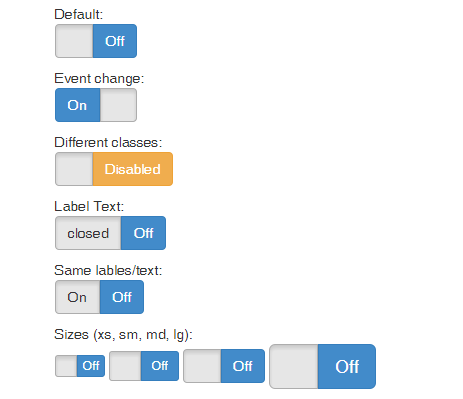

Very simple, fast and lightweight (> 2K) jquery plugin for bootstrap to render checkbox like iOS style switch button.

## Usage

```javascript
$(SELECTOR).bootstrapSwitch({
    on: 'On', // default 'On'
    off: 'Off', // default 'Off'
    onLabel: 'closed', //default ''
    offLabel: 'open', //default ''
    same: false, // default false. same text for on/off and onLabel/offLabel
    size: 'lg', // xs/sm/md/lg, default 'md'
    onClass: 'primary', //success/primary/danger/warning/default, default 'primary'
    offClass: 'default', //success/primary/danger/warning/default default 'default'
});
```
## Install
Copy the ```bootstrap-switch.js``` or use bower to install:

```
bower install bootstrapswitch
```

